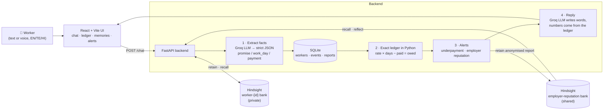

# HakDaar 🛡️

**Your work. Your wages. Remembered.**

HakDaar is an AI rights companion for migrant and daily-wage workers in Hyderabad. Construction workers
and helpers often lose wages because employers break verbal promises. With HakDaar, a worker simply
chats (in **English, తెలుగు or हिंदी**, typed or spoken) about their work. HakDaar:

- **remembers** what each employer promised, the days worked and the payments received, across sessions;
- **calculates exactly** what is owed and flags underpayment with a clear red alert;
- **learns across workers**: if an employer has underpaid other workers before, it warns the next worker,
  without ever revealing who reported it.

Memory is powered by **[Hindsight](https://github.com/vectorize-io/hindsight) by Vectorize**. Built for **HackwithHyderabad 3.0**.

> _HakDaar is not legal advice. For help, contact your local labour office._

---

## Quick start

**Prerequisites:** Docker Desktop (running), Python 3.11+, Node.js 20.19+ (or 22+), and a [Groq API key](https://console.groq.com/keys).

```bash
git clone https://github.com/riyanshareefshaik/HakDaar.git && cd HakDaar
cp .env.example .env              # then put your GROQ_API_KEY in .env

./scripts/start-hindsight.sh      # 1. memory server (first run downloads a large image, be patient)
./scripts/start-backend.sh        # 2. API on http://localhost:8000   (new terminal)
./scripts/start-frontend.sh       # 3. app on http://localhost:5173   (new terminal)
```

Open **http://localhost:5173** and click **Load demo data**. Wait ~60 s for Hindsight to process the
memories, then pick **Ravi** and start chatting.

| Service | URL |
|---|---|
| HakDaar app | http://localhost:5173 |
| HakDaar API docs (Swagger) | http://localhost:8000/docs |
| Health check | http://localhost:8000/health |
| Hindsight API | http://localhost:8888 |
| Hindsight UI (inspect memory banks) | http://localhost:9999 |

<details>
<summary>Manual commands (Windows or no bash)</summary>

```bash
# Hindsight (replace YOUR_KEY)
docker run -d --pull missing --name hindsight --restart unless-stopped --shm-size=1g \
  -p 8888:8888 -p 9999:9999 \
  -e HINDSIGHT_API_LLM_PROVIDER=groq \
  -e HINDSIGHT_API_LLM_API_KEY=YOUR_KEY \
  -e HINDSIGHT_API_LLM_MODEL=openai/gpt-oss-20b \
  -e HINDSIGHT_API_LLM_GROQ_SERVICE_TIER=on_demand \
  -e HINDSIGHT_API_WORKER_ID=hakdaar-local \
  -v hindsight-data:/home/hindsight/.pg0 \
  ghcr.io/vectorize-io/hindsight:latest

# Backend
cd backend
python -m venv .venv && .venv\Scripts\activate      # macOS/Linux: source .venv/bin/activate
pip install -r requirements.txt
uvicorn app.main:app --reload --port 8000

# Frontend
cd frontend && npm install && npm run dev
```
</details>

---

## Demo script (2 minutes)

1. **Load demo data.** Three workers appear:
   - **Ravi** (Telugu): Suresh Constructions promised ₹700/day, 6 days worked, paid ₹3,000 → **owed ₹1,200**.
   - **Lakshmi** (Hindi): also worked for Suresh Constructions; paid **late and short**.
   - **Imran** (English): Green Homes paid fully and on time → **owed ₹0**.
2. **Ravi**: the ledger shows **Owed ₹1,200** in red. *Employer alerts* shows "1 other worker reported
   short or late payment from Suresh Constructions" (that's Lakshmi, anonymised).
3. Say or type: **"ఈ రోజు ఇంకో 2 రోజులు పని చేశాను"** ("I worked 2 more days today"). HakDaar notes
   **+2 days**, the red banner shows **₹2,600 owed**, the reply comes in Telugu, and the *Memories* card shows
   what Hindsight recalled to write it.
4. Click **"What have workers reported?"**. Hindsight `reflect()` summarises Suresh Constructions' record
   from the shared `employer-reputation` bank.
5. Switch to **Imran**: green ₹0, no warnings. The same system reports good employers too.
6. Refresh the page or restart the backend. Everything is still remembered.

---

## Architecture



### What happens on each message
1. **Extract.** Groq turns the message into strict JSON events
   `{type, employer_name, amount, days, date, notes}`. The prompt forbids any arithmetic. Phrases like
   "8 days in total" or "he paid the rest" are flagged (`is_total`, `pays_full_balance`), and **Python**
   resolves them against the ledger.
2. **Store and compute.** Events go to SQLite. `ledger.py` computes each employer's earned, paid and owed
   amounts with `Decimal`. **The LLM never does maths**, so every rupee shown is exact and auditable.
   Employer names are normalised ("suresh" → "Suresh Constructions") so one employer never splits into two rows.
3. **Alerts and learning.** If money is owed, an underpayment alert is raised. After any payment, an
   **anonymised** report ("A worker reported a short payment from X…") is written to SQLite (for exact
   counts) **and** retained into the shared Hindsight bank.
4. **Remember and recall.** The message and its facts are `retain`ed into the worker's own bank. HakDaar
   `recall`s from the worker's bank and from `employer-reputation` in parallel.
5. **Reply.** Groq writes a short, kind reply in the worker's language using the recalled memories plus
   the exact ledger figures.

### How Hindsight is used

| Operation | Where | Why |
|---|---|---|
| `retain` | every chat turn → `worker-{id}` | Long-term personal memory: promises, dates, worries, context |
| `retain` | after a payment → `employer-reputation` | Cross-worker learning, anonymised (no names ever stored) |
| `retain_batch` | `/demo/seed` | Pre-loads realistic history (with past timestamps) so memory exists before the demo |
| `recall` | every chat turn, both banks | Context for the reply, shown live in the **Memories** card |
| `recall` | `GET /workers/{id}/memories` | "What HakDaar remembers" when you open a worker |
| `reflect` | `GET /employers/{name}/reputation` | A reasoned summary of an employer's payment record |
| `create_bank` | new worker / seed | Sets each bank's *retain mission* so Hindsight extracts wage-relevant facts |
| `delete_bank` | `/demo/reset` | Clean demo resets |

**Bank design:** one private bank per worker (`worker-{worker_id}`), strictly isolated, plus one shared
`employer-reputation` bank. Worker ids are random (`ravi-3f9a1c`) and never reused, so a reset can never
leak one worker's memory into another's.

**Why both SQLite and Hindsight?** Hindsight holds the *meaning*: what was said, when, and patterns across
workers. SQLite holds the *numbers*. Money needs exact arithmetic, and memory needs understanding.

### Failure handling
- **Groq down:** `/chat` returns a clear 503 *before* storing anything, so a retry never double-counts.
  If Groq fails after the facts are saved, a plain fallback reply is sent instead.
- **Hindsight down:** chat still works (the ledger is in SQLite). The reply carries a
  "Memory is offline" warning and the UI shows an amber banner.
- **Backend down:** the UI shows a friendly screen with the exact command to start it.

---

## API

| Method | Path | What it does |
|---|---|---|
| GET | `/health` | Checks that Hindsight and Groq are reachable |
| GET / POST | `/workers` | List workers / create `{name, language: en\|te\|hi, phone?}` |
| PATCH | `/workers/{id}` | Change reply language `{language}` |
| POST | `/chat` | `{worker_id, message}` → `{reply, extracted_events, alerts, recalled_memories, ledger, warnings}` |
| GET | `/workers/{id}/messages` | Chat history |
| GET | `/workers/{id}/ledger` | Per employer: rate promised, days worked, earned, paid, **owed** |
| GET | `/workers/{id}/memories` | What Hindsight recalls about this worker |
| GET | `/workers/{id}/alerts` | Current underpayment and reputation alerts |
| GET | `/employers/{name}/reputation` | Exact report counts plus Hindsight `reflect()` summary |
| POST | `/demo/seed` · `/demo/reset` | Load the demo story / wipe SQLite and HakDaar's memory banks |

`{id}` also accepts a unique worker name (e.g. `/workers/ravi/ledger`), which is handy in Swagger.

## Project structure

```
backend/
  app/main.py      FastAPI routes + error handling
  app/chat.py      the /chat pipeline: extract → ledger → alerts → memory → reply
  app/llm.py       Groq calls: strict-JSON extraction and the reply prompt
  app/ledger.py    exact wage arithmetic (Decimal), ₹ formatting
  app/memory.py    Hindsight wrapper: banks, retain / recall / reflect
  app/db.py        SQLite schema and queries
  app/seed.py      demo story (Ravi, Lakshmi, Imran)
  tests/           ledger + end-to-end API tests (Groq and Hindsight mocked)
frontend/
  src/App.jsx                   state, layout (3 columns on desktop, bottom tabs on mobile)
  src/components/ChatPanel.jsx  chat, voice input, typing indicator, underpayment banner
  src/components/MemoryPanel.jsx wage ledger, memory chips, employer alerts
  src/i18n.js                   English / Telugu / Hindi UI strings
scripts/            start-hindsight.sh, start-backend.sh, start-frontend.sh
```

## Configuration (`.env`)

| Variable | Default | Purpose |
|---|---|---|
| `GROQ_API_KEY` | — | Required. Used by the backend and passed to Hindsight |
| `GROQ_MODEL` | `llama-3.3-70b-versatile` | Model for extraction and replies |
| `HINDSIGHT_URL` | `http://localhost:8888` | Hindsight API |
| `HINDSIGHT_LLM_MODEL` | `openai/gpt-oss-20b` | Model Hindsight uses internally |
| `DATABASE_PATH` | `hakdaar.db` | SQLite file (relative to `backend/`) |

## Tests

```bash
cd backend && source .venv/bin/activate && pip install -r requirements-dev.txt && python -m pytest -q
```
The tests mock Groq and Hindsight, so they need neither.

## Troubleshooting
- **Docker "Pulling fs layer" seems stuck:** the Hindsight image is several GB; let it finish.
  `docker pull ghcr.io/vectorize-io/hindsight:latest` shows progress bars.
- **Memories card is empty right after seeding:** Hindsight processes memories in the background. Wait
  about a minute, then re-select the worker.
- **Groq 429 (rate limit):** wait a few seconds; the free tier has per-minute limits.
- **Mic button missing:** the browser doesn't support the Web Speech API (use Chrome or Edge).

## License
MIT
